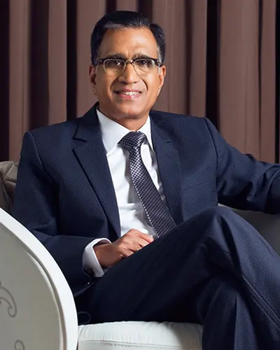
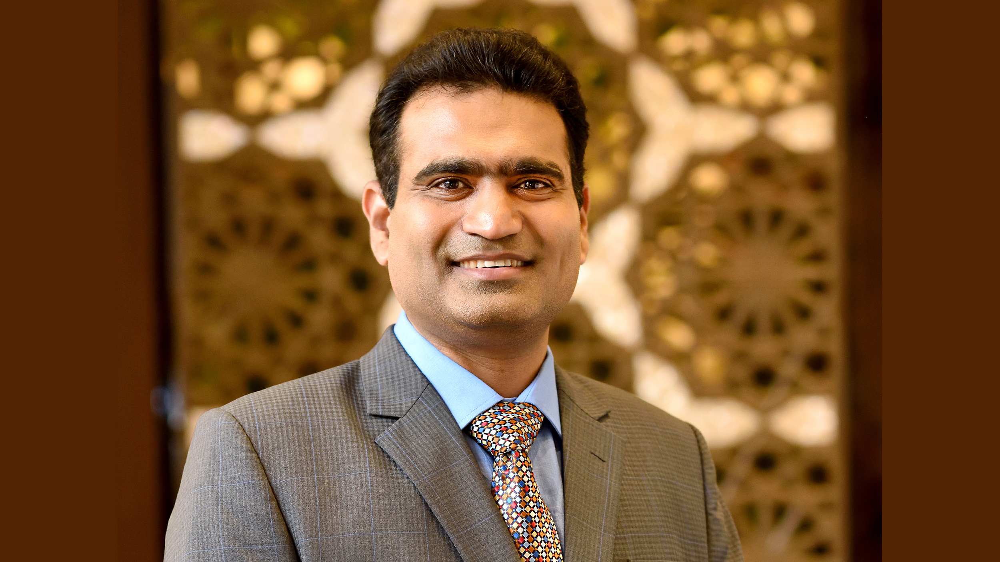

=== "ABOUT US"
    When you gift jewellery you achieve immortality in their heart............................
    We are one of the oldest business families in India with a family legacy of over a century in business, starting from as early as 1908. Started for the noble cause of nation-building and self-sustenance in a pre-independent India, the forefathers believed ethical, honest and transparent business practices should form the foundation of the group.
=== "CMD'S message"

    T.S. Kalyanaraman

    
    Today, when I look around me, business is all about toplines, bottomlines and market capitalisation. But Kalyan entered into business in a pre-independent India to build a better India, as our forefathers believed ethical, fair business will make India self-sufficient and strong.Personally, I believe Kalyan Jewellers' major achievement is the trust we have earned from millions of people across the length and breadth of a huge subcontinent like India, and abroad in the GCC.

    We have always believed in fair and transparent business. We have believed that the customer should be understood so well that we know his needs much before he understands them himself. We have believed that an enlightened customer is the best customer. These are the simple principles that have helped us reach where we are today.

    Today, Kalyan Jewellers has 150 retail stores spread across INDIA and MIDDLE EAST. Pampered by your unbound love and support and with the blessings of the Almighty, we believe we are in the right path towards the accomplishment of our vision to open stores and serve customers across the world.
=== "ED's Message"

    Rajesh Kalyanaraman - Executive Director
    

    I feel our biggest differentiator is not only the ability to understand local, think local and act local, but at the same time bring in our vast experience and sourcing strength out of operating in multiple markets. Jewellery is a complicated product, because tastes vary even within the same state. What helps us here is the huge variety of products we stock from artisans across the country and even the Arab countries. We carefully and painstakingly select the designs of our products and customise them according to the demands of the consumer demography of each market we step into as India is such a vast country with diverse tastes
=== "Vision"

     
     
    To understand and delight the world, translating everyone’s dream and personality into fine Indian jewellery, and spread the happiness from it to all.
=== "Mission"

    

    To give every customer much more than what he/she asks for in terms of quality, selection, value for money and customer service, by understanding local tastes and preferences and innovating constantly to eventually provide an unmatched experience in Indian jewellery shopping.
=== "OUR NETWORK"
    With over 150 showrooms, Kalyan Jewellers is spread across India and the Middle East.

    India

    We have a strong presence across 21 states and union territories, and our 120-plus network of showrooms cover all major cities. Moreover, the 'My Kalyan' hub-and-spoke model outlets, act as Customer Service Centers, ensuring Kalyan Jewellers is more accessible to households in rural areas.