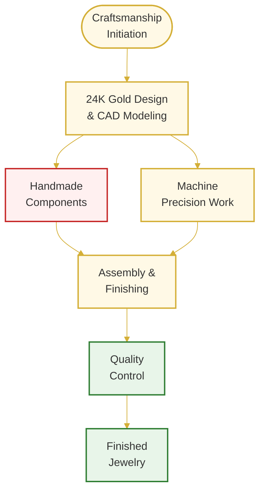

## Our Craftsmanship Philosophy

At Kalyan Jewellers, we blend centuries-old techniques with modern technology to create jewelry that stands the test of time:

- **22-Step Quality Process from raw material to finished product**
- **1 Gram Precision in gold weight measurement**
- **100-Point Inspection before reaching our customers**
- **0 Compromise on purity and finishing**

