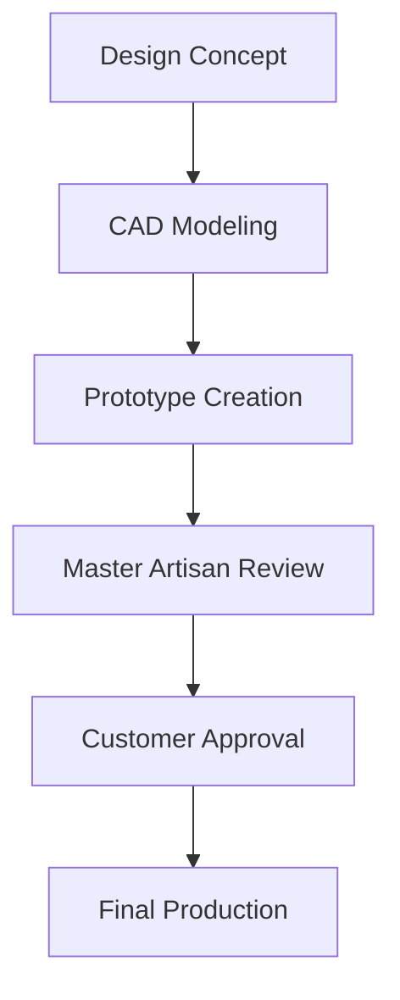

## Our Craftsmanship Philosophy

At Kalyan Jewellers, we blend centuries-old techniques with modern technology to create jewelry that stands the test of time:

- **22-Step Quality Process** from raw material to finished product
- **1 Gram Precision** in gold weight measurement
- **100-Point Inspection** before reaching our customers
- **0 Compromise** on purity and finishing

