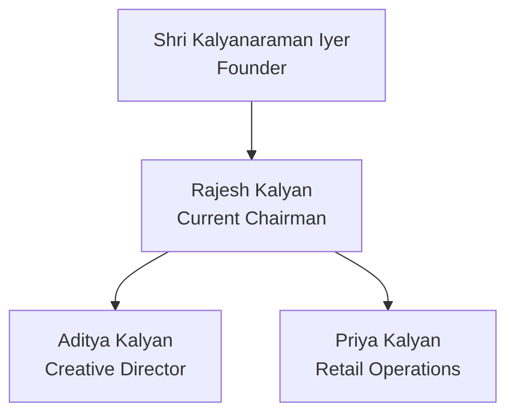

# Heritage

## The Kalyan Story

Founded in 1985 by Shri Kalyanaraman Iyer, what began as a small jewelry workshop in Chennai has grown into one of India's most trusted jewelry brands. Our journey reflects:

- **1985**: Humble beginnings with a single store in T. Nagar, Chennai
- **1998**: First expansion to Bangalore with innovative jewelry designs
- **2005**: Became first Indian jeweller to receive ISO 9001 certification
- **2012**: Launched our signature "Kalyani" bridal collection
- **2020**: Expanded to 50 showrooms across South India
- **2023**: Introduced blockchain-based gold certification

## Family Tradition

