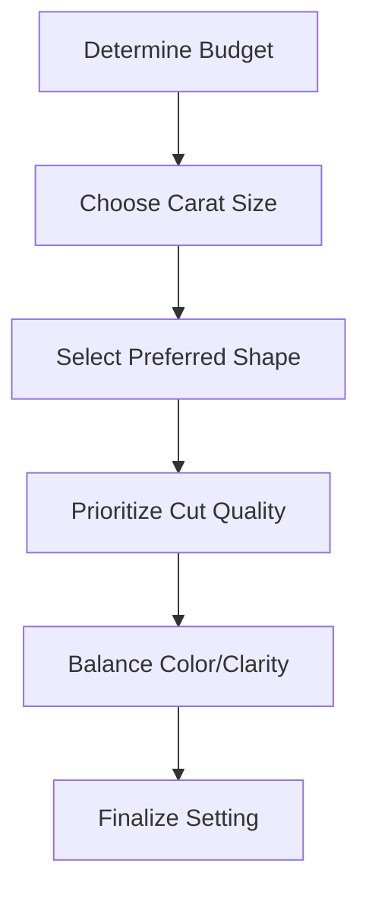

# Kalyan Diamond Collections

  

    <h1>Exceptional Diamonds, Unmatched Brilliance</h1>
    
GIA-certified diamonds set in exquisite craftsmanship

  

## Our Diamond Promise

{ width=60 }  
**Certified Quality**  
Every diamond above 0.3ct comes with GIA/IGI certification

{ width=60 }  
**4C Transparency**  
Detailed grading reports for all stones

{ width=60 }  
**100x Inspection**  
Laser-mapped inclusions before setting

## Diamond Collections

=== "Bridal Diamonds"
    { loading=lazy align=right width=350 }
    
    **Heirloom-quality diamond sets**
    - Signature Kalyan bridal necklaces
    - Three-stone engagement rings
    - Diamond jadau harams
    - Matching sets with 1ct+ center stones
    
    [View Bridal Collection](#){: .md-button .md-button--primary }

=== "Solitaire"
    { loading=lazy align=left width=350 }
    
    **Timeless solitaire elegance**
    - 0.5ct to 5ct center stones
    - 6-prong platinum settings
    - Ideal-cut round brilliants
    - Hidden halo options
    
    [Explore Solitaires](#){: .md-button }

=== "Designer Diamonds"
    { loading=lazy align=right width=350 }
    
    **Contemporary statement pieces**
    - Geometric cocktail rings
    - East-west emerald cuts
    - Floating diamond pendants
    - Mixed metal designs
    
    [View Designer Collection](#){: .md-button }

## The 4Cs of Diamonds

### Cut
{ loading=lazy }
- Excellent/ideal proportions
- Kalyan signature 91-facet cut
- Maximized light performance

### Color
{ loading=lazy }
- D-F (Colorless) available
- G-H (Near colorless) recommended
- Fancy colored diamonds

### Clarity
{ loading=lazy }
- VVS1-VS2 (Eye-clean)
- SI1 carefully selected
- Inclusion mapping provided

### Carat
{ loading=lazy }
- 0.3ct to 10ct available
- Milestone sizes (0.5, 1, 2ct)
- Total carat weight specified

## Diamond Buying Guide

