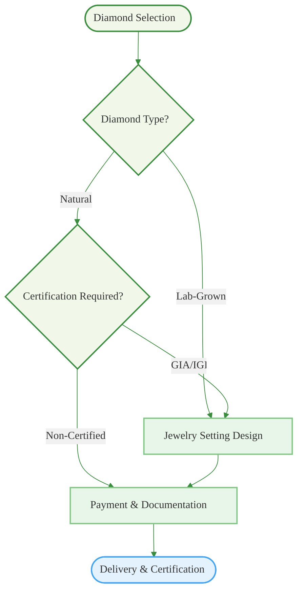

# Kalyan Diamond Collections

# **Diamond Jewellery – The Sparkle of Elegance**  

Diamonds symbolize eternal love, brilliance, and unmatched luxury. At **Kalyan Jewellers**, we bring you a stunning collection of **certified diamond jewelry**, crafted to perfection for every occasion.  

## **Our Diamond Collection**  
💎 **Engagement & Wedding Rings** – Timeless solitaires and elegant halo designs.  
✨ **Diamond Necklaces & Pendants** – A blend of modern and classic styles.  
🌟 **Earrings & Studs** – Perfectly cut diamonds for everyday and special moments.  
💍 **Diamond Bangles & Bracelets** – Statement pieces with breathtaking brilliance.  
👑 **Bridal Diamond Collection** – Exquisite sets to complete your wedding look.  

## **Why Choose Kalyan Jewellers?**  
✔ **Certified Diamonds for Unmatched Quality**  
✔ **Expertly Crafted with Precision & Elegance**  
✔ **Ethically Sourced & Responsibly Manufactured**  
✔ **Customization Options to Suit Your Style**  

