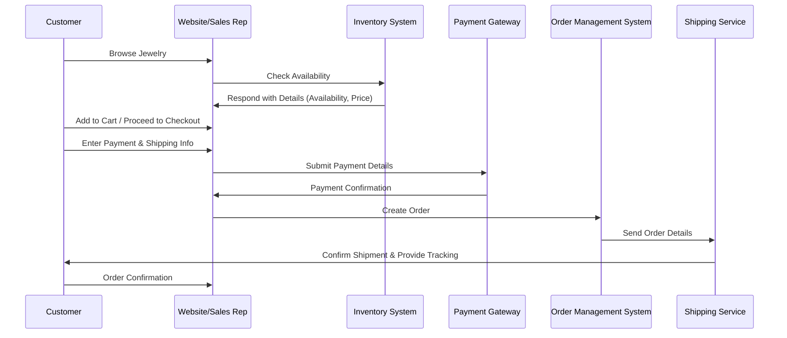

```mermaid
sequenceDiagram
    participant C as Customer
    participant W as Website/Sales Rep
    participant I as Inventory System
    participant P as Payment Gateway
    participant O as Order Management System
    participant S as Shipping Service

    C->>W: Browse Jewelry
    W->>I: Check Availability
    I->>W: Respond with Details (Availability, Price)
    C->>W: Add to Cart / Proceed to Checkout
    C->>W: Enter Payment & Shipping Info
    W->>P: Submit Payment Details
    P->>W: Payment Confirmation
    W->>O: Create Order
    O->>S: Send Order Details
    S->>C: Confirm Shipment & Provide Tracking
    C->>W: Order Confirmation
```