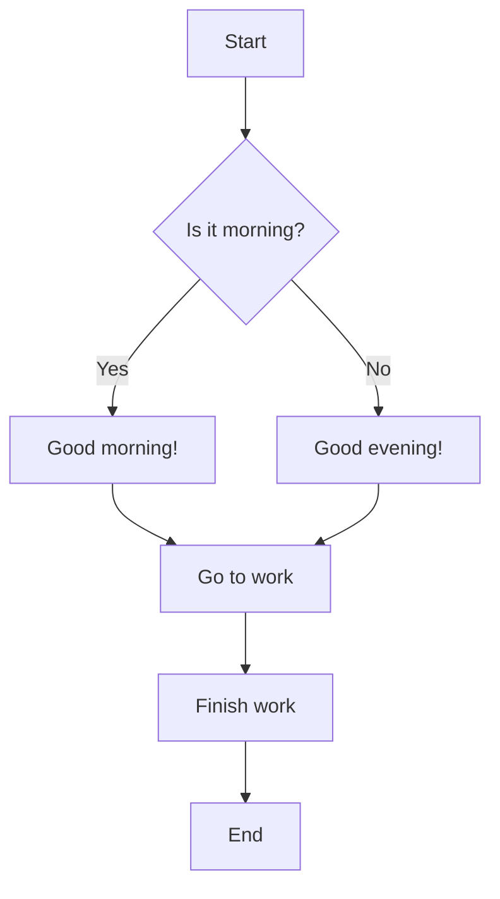

```mermaid
flowchart TD
    A[Start] --> B{Is it morning?}
    B -->|Yes| C[Good morning!]
    B -->|No| D[Good evening!]
    C --> E[Go to work]
    D --> E[Go to work]
    E --> F[Finish work]
    F --> G[End]
```