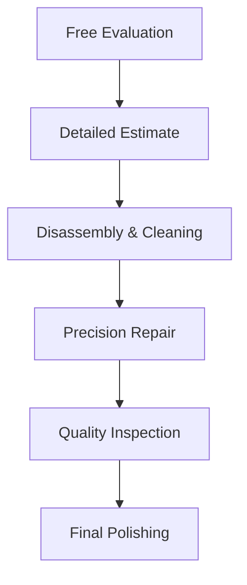

# Jewelry Repair & Restoration

  

    <h1>Expert Jewelry Care</h1>
    
Restoring your precious pieces with master craftsmanship

  

## Our Repair Services

{ loading=lazy }
### Ring Services
- **Resizing** (up/down 3 sizes)
- **Shank Replacement**
- **Prong Retipping**
- **Stone Tightening**

{ loading=lazy }
### Chain & Necklace
- **Link Repair**
- **Clasp Replacement**
- **Knotting Restringing**
- **Length Adjustment**

{ loading=lazy }
### Restoration
- **Heirloom Repair**
- **Engraving Revival**
- **Metal Refinishing**
- **Stone Replacement**

## The Kalyan Repair Process

