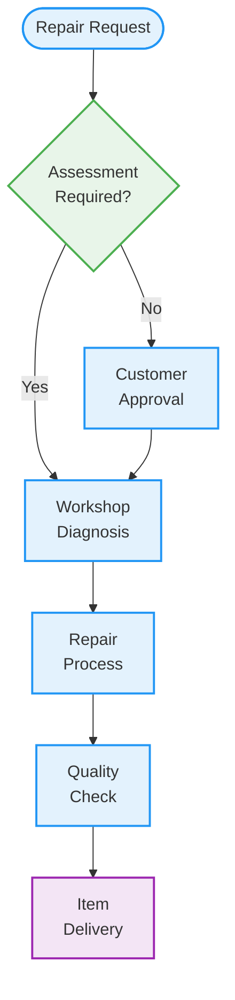

# Jewelry Repair & Restoration

# **Jewellery Repair – Restore the Brilliance**  

At **Kalyan Jewellers**, we understand the sentimental value of your jewellery. Our **expert repair services** ensure that your treasured pieces regain their original beauty and strength, whether it's a family heirloom or a daily wear favourite.  

## **Our Repair Services**  
🔧 **Ring Resizing** – Perfect fit adjustments for comfort and elegance.  
💎 **Stone Replacement** – Restore missing or damaged gemstones and diamonds.  
🔗 **Chain & Bracelet Repair** – Fix broken clasps, links, and fasteners.  
✨ **Polishing & Cleaning** – Bring back the original shine and sparkle.  
🛠 **Antique Jewellery Restoration** – Preserve and restore vintage pieces with expert care.  

## **Why Choose Kalyan Jewellers?**  
✔ **Skilled Craftsmanship & Precision Repairs**  
✔ **High-Quality Materials & Expert Techniques**  
✔ **Quick & Reliable Service with Transparency**  
✔ **Trusted by Millions for Jewellery Care**  

## The Kalyan Repair Process

